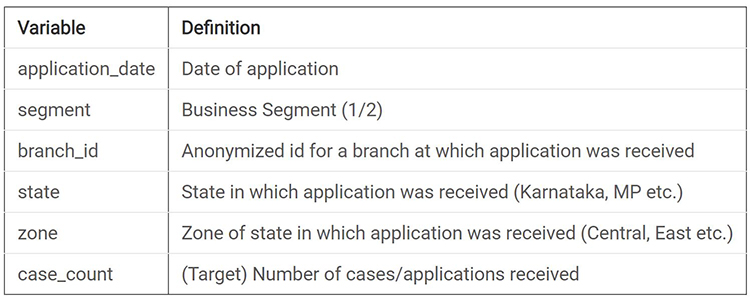
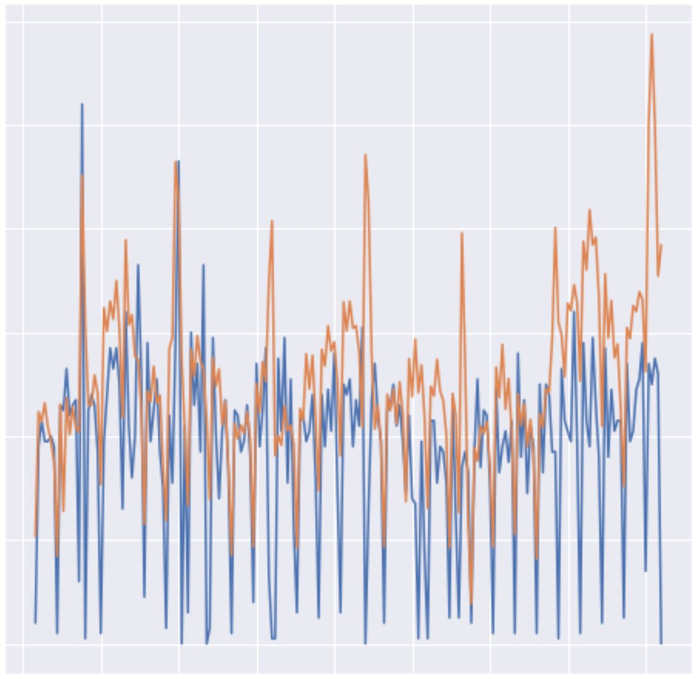

# Business-Forecasting
Client receives a lot of requests for its various finance offerings that include housing loans, two-wheeler loans, real estate financing, and microloans. The number of applications received is something that varies a lot with the season. Going through these applications is a manual and tedious process.

Goal is to forecast daily cases for the next 3 months for 2 different business segments aggregated at the country level keeping in consideration the following major Indian festivals

Models Used:
1.AR(P)
2.Auto-ARIMA
3.SARIMA
4.Fb-PROPHET

Finally I considered Fb-Prophet because it was giving a better result in terms of MAE.

